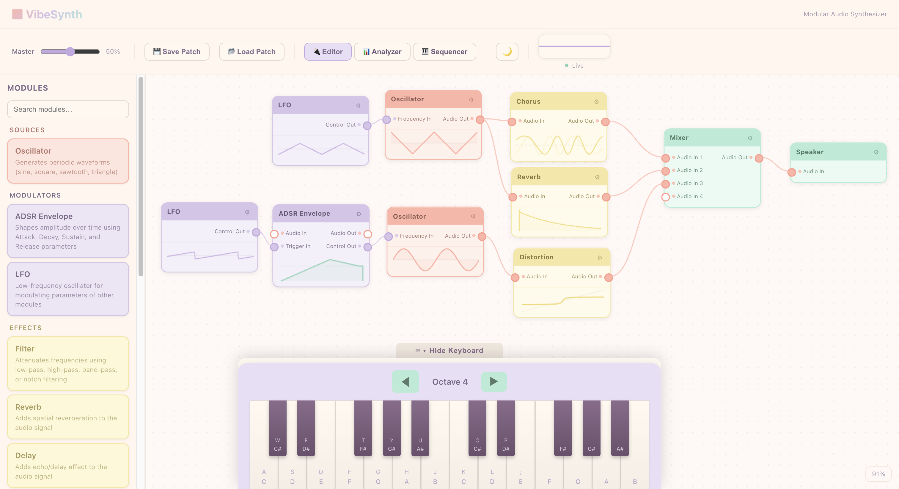

# VibeSynth

A modular audio synthesizer built with React, TypeScript, and the Web Audio API. Design sounds by connecting modules in a visual node graph — oscillators, filters, effects, envelopes, and more.



## Features

- **Visual node graph** — drag-and-drop modules, connect ports with cables
- **14 built-in modules** — oscillators, filter, ADSR envelope, LFO, reverb, delay, distortion, chorus, EQ 3-band, compressor, stereo panner, mixer, gain, output
- **Polyphonic** — up to 8 voices with per-voice ADSR envelopes and voice stealing
- **LFO modulation** — route LFOs to filter cutoff, panner, compressor threshold, EQ gains, and more via control ports
- **Inline visualizations** — each module shows a live preview of its settings (waveform, filter response, EQ curve, etc.)
- **MIDI support** — plug in a MIDI controller and play
- **Patch save/load** — export and import patches as JSON files
- **Sequencer, arpeggiator, and latch** — built-in performance tools
- **Dark/light themes**

## Getting Started

```bash
# Install dependencies
npm install

# Start dev server
npm run dev
```

Open `http://localhost:5173` in your browser.

## Usage

1. **Add modules** — drag from the module palette on the left onto the graph
2. **Connect modules** — click an output port and drag to an input port
3. **Play notes** — use the on-screen keyboard or a MIDI controller
4. **Tweak parameters** — adjust knobs on each module node
5. **Save/load patches** — use the toolbar buttons to export/import JSON patches

### Example signal chain

```
Oscillator (saw) ──┐
                   ├→ Mixer → EQ → Filter → ADSR → Chorus → Compressor → Reverb → Output
Oscillator (square)┘
```

## Example Patches

Pre-made patches are available in the `Downloads` folder:
- **Linkin Park - Numb (Intro)** — dark, detuned saw/square pad
- **The Weeknd - Blinding Lights (Intro)** — bright 80s synth with auto-pan LFO

Load them via the toolbar's Load button.

## Scripts

| Command | Description |
|---------|-------------|
| `npm run dev` | Start development server |
| `npm run build` | Type-check and production build |
| `npm run preview` | Preview production build locally |
| `npm run test` | Run tests |
| `npm run lint` | Lint with ESLint |

## Tech Stack

- React 19 + TypeScript
- Vite
- Web Audio API
- Vitest for testing
